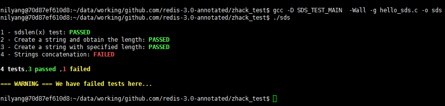

# redis 测试驱动学习

通过测试代码，以及一步一步来学习redis源码。

### 使用的工具：

- gcc
- gdb
- docker ubuntu
- windows 10

注意事项，gdb调试需要将内存随机模型值设为0（静态分配，不随机），但是在windows下，docker run必须指定权限参数

gcc 生成代码

```

$ gcc -D SDS_TEST_MAIN  -Wall -g hello_sds.c -o sds

```

### gdb 调试命令

1. 先设置断点
2. run 运行程序
3. next 单步运行
4. step 单步调试
5. list [-+] 查看当前运行代码上下文（前后若干行）
6. show print pretty
  - - show print pretty 查看格式化打印状态
  - - set print union on 打开结构体打印开关
  - - 例子：打印sdshdr结构体 

```
$gdb ./sds
(gdb) break sdsnew
(gdb) next
(gdb) print *((struct sdshdr *)(x - (sizeof(struct sdshdr))))
$25 = {
  len = 3,
  free = 0,
  buf = 0x602428 "foo"
}
```

### 测试

测试用例结果高亮显示


